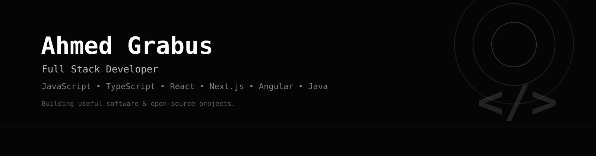

  

<h1 align="center">Ahmed Grabus</h1>

  

Building modern web applications with a focus on clean architecture, performance and user experience.

---

## Tech Stack

  

---

## GitHub Statistics

  

  

---

## Activity

  

---

## Connect

  

