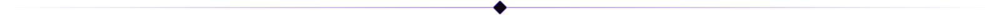

  

## About

Software Engineer at **ZIRA**, based in Bosnia and Herzegovina.
I build full-stack products end to end - .NET backends, Angular and Next.js frontends, Flutter mobile apps - with a focus on clean architecture, performance and user experience.

## Featured projects

### [GrabPoints](https://github.com/grabator/IB210176-seminarski-rs2)
Fantasy Premier League companion with ML-driven recommendations for predicted points, captain picks and transfers. Microservice architecture with a .NET 10 API and a background worker over RabbitMQ, plus a Flutter mobile app and desktop admin.

`.NET 10` `RabbitMQ` `ONNX Runtime` `SQL Server` `Stripe` `Flutter` `Docker`

### [Exclusive Lounge Reservations](https://github.com/grabator/exclusive-lounge-caffe-rezervacije)
Table reservation platform for a café lounge with an interactive floor plan, admin panel and Telegram / WhatsApp / Viber integration.

`Angular` `TypeScript` `.NET` `SCSS` `Docker`

### [Dežurne apoteke BiH](https://github.com/grabator/dezurne-apoteke)
Mobile-first web app that shows which pharmacies are on duty right now in Bosnia and Herzegovina - with distance, one-tap calling and directions.

`Next.js 16` `React 19` `PWA`

## Tech stack

**Backend**
 

**Frontend**
 

**Mobile & tools**
 

