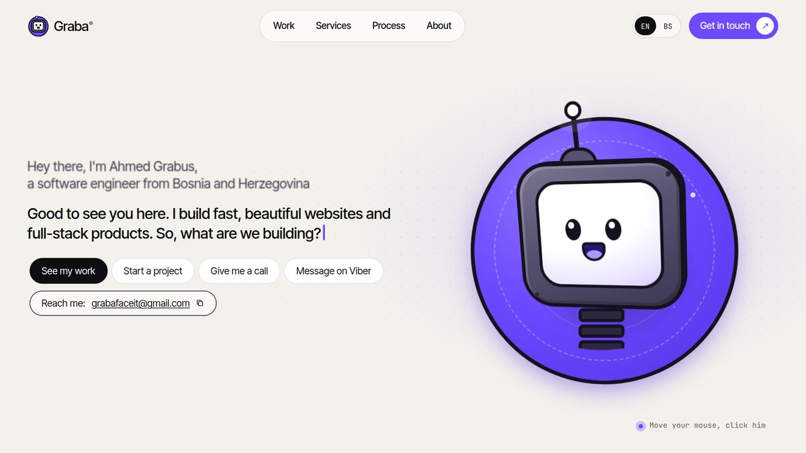
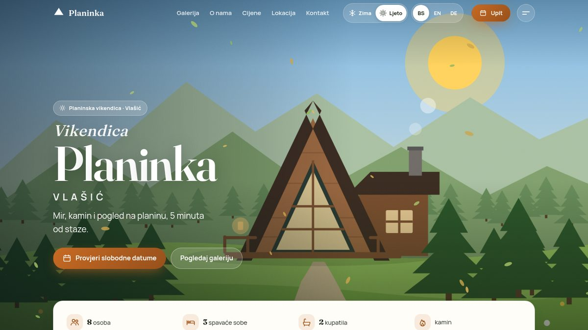
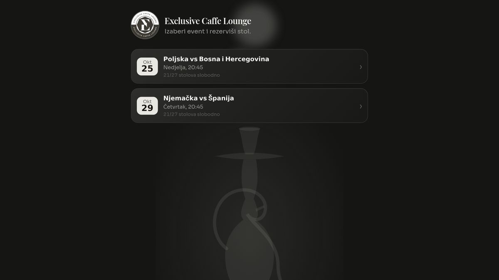
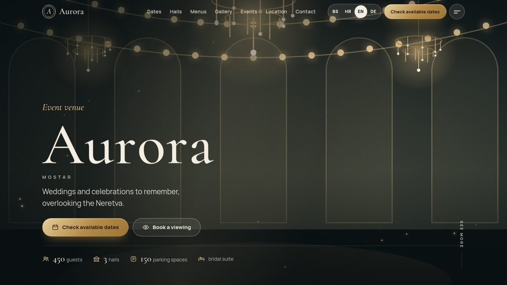
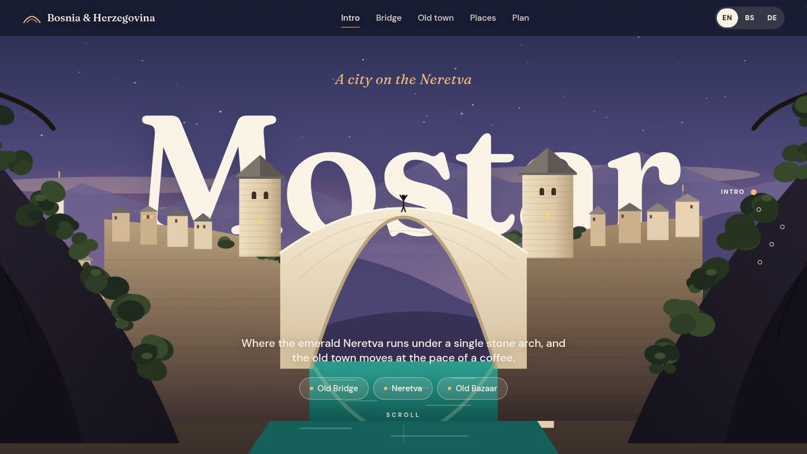

  

## About

Software Engineer at **ZIRA**, based in Bosnia and Herzegovina.
I build full-stack products end to end - .NET backends, Angular and Next.js frontends, Flutter mobile apps - with a focus on clean architecture, performance and user experience.

**Portfolio:** [graba-portofolio.grabafaceit.workers.dev](https://graba-portofolio.grabafaceit.workers.dev)

## Featured projects

### [Portfolio](https://graba-portofolio.grabafaceit.workers.dev)

My personal site, built by hand with no frameworks. A little robot drawn in pure CSS turns its head in 3D to follow the cursor, blinks, falls asleep when you leave it alone and knows a few tricks when you click it. Bilingual (English / Bosnian), fast and accessible · [live](https://graba-portofolio.grabafaceit.workers.dev) · [source](https://github.com/grabator/graba-portofolio)

`JavaScript` `HTML` `CSS` `Cloudflare Workers`

### [MyShishapedia](https://myshishapedia.com)
Bilingual (Bosnian / English) hookah flavor encyclopedia with ingredient breakdowns, flavor profiles, side-by-side comparisons, mix recipes, a mixer and a quiz. Built without frameworks: a custom static site generator prerenders 190+ pages, with fuzzy search, shareable story cards and a strict CSP. Live on Cloudflare Pages · [myshishapedia.com](https://myshishapedia.com) · [source](https://github.com/grabator/myshishapedia)

`JavaScript` `HTML` `CSS` `Node.js` `SVG` `Cloudflare Pages`

### Websites and apps for local businesses
Fast, mobile-first work for real places: no heavy frameworks where they are not needed, several languages, and inquiries that go straight to the owner.

<table>
  <tr>
    <td width="50%" valign="top">
      
       <strong><a href="https://planinka.grabafaceit.workers.dev/">Planinka</a></strong>
       Mountain cabin on Vlašić: seasonal prices with a stay calculator, live weather, gallery and booking inquiries. BS · EN · DE.
       <a href="https://planinka.grabafaceit.workers.dev/">live</a> · <a href="https://github.com/grabator/planinka">source</a>
    </td>
    <td width="50%" valign="top">
      
       <strong><a href="https://rezervacije-production-6f84.up.railway.app/r/exclusive/rezervacije">Exclusive Lounge</a></strong>
       Table booking app for a café lounge: guests pick an event and their exact table on an interactive floor plan. Admin panel, PDF guest list and Telegram alerts. Angular 19 · .NET 10 · SQLite.
       <a href="https://rezervacije-production-6f84.up.railway.app/r/exclusive/rezervacije">live</a> · <a href="https://github.com/grabator/exclusive-lounge-caffe-rezervacije">source</a>
    </td>
  </tr>
  <tr>
    <td width="50%" valign="top">
      
       <strong><a href="https://github.com/grabator/svecana-sala">Svečana sala</a></strong>
       Wedding venue demo: availability calendar synced from Google Calendar through a Cloudflare Worker, instant price estimate, viewing booking and a guest page with QR code. 4 languages.
       <a href="https://github.com/grabator/svecana-sala">source</a>
    </td>
    <td width="50%" valign="top">
      
       <strong><a href="https://github.com/grabator/old-bridge-mostar">Old Bridge Mostar</a></strong>
       Cinematic scroll story: layered SVG scenes of the Old Bridge and the Neretva, a diver leaping from the arch and an endless places slider.
       <a href="https://github.com/grabator/old-bridge-mostar">source</a>
    </td>
  </tr>
</table>

`JavaScript` `HTML` `CSS` `SVG` `Angular` `.NET` `Cloudflare Workers`

### [GrabPoints](https://github.com/grabator/IB210176-seminarski-rs2)
Fantasy Premier League companion with ML-driven recommendations for predicted points, captain picks and transfers. Microservice architecture with a .NET 10 API and a background worker over RabbitMQ, plus a Flutter mobile app and desktop admin.

`.NET 10` `RabbitMQ` `ONNX Runtime` `SQL Server` `Stripe` `Flutter` `Docker`

### [Dežurne apoteke BiH](https://github.com/grabator/dezurne-apoteke)
Mobile-first web app that shows which pharmacies are on duty right now in Bosnia and Herzegovina - with distance, one-tap calling and directions.

`Next.js 16` `React 19` `PWA`

## Tech stack

**Backend**
 

**Frontend**
 

**Mobile & tools**
 

